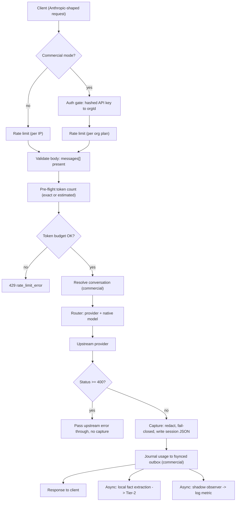
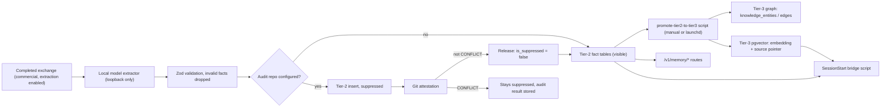

# Stratum architecture

This document describes what the Stratum code does today. Design documents
such as `MEMORY_ARCHITECTURE.md` and `AUDIT_ENGINE.md` describe the target
design; where the code differs, this document follows the code. Citations use
repo-relative `path:line`. It describes code paths and reports no test run.

- The hosted Supabase project is retired. Development uses a local Compose
  stack (ADR-0020). No production deployment topology is chosen.
- Pruning does not change any request. The pruner runs only in shadow mode.
- No TEE enclave exists. `stratum/src/proxy/tee/gateway.ts` is a TODO stub.

## 1. Components

| Component | Code | What it does today |
|---|---|---|
| Proxy entry | `stratum/src/proxy/index.ts` | Reads env, picks the mode, builds the app, listens, drains on SIGTERM/SIGINT |
| App factory | `stratum/src/proxy/app.ts` | Builds a Fastify instance. It registers only the routes whose deps are supplied |
| Messages route | `stratum/src/proxy/routes/messages.ts` | `POST /v1/messages`: count, gate, forward, capture, journal usage, memory, shadow |
| Provider router | `stratum/src/proxy/providers/router.ts` | Maps a model id to Anthropic, OpenAI, OpenRouter, Gemini or a local server |
| Capture store | `stratum/src/proxy/capture.ts` | Redacts each turn (fail-closed) and writes a session JSON file |
| Shadow observer | `stratum/src/proxy/shadow-observer.ts` | Runs the pruner on a private window and logs counts. Never alters traffic |
| Memory | `stratum/src/memory/` | Tier-1 RAM window, Tier-2 fact tables, Tier-3 graph and vectors |
| Pruner | `stratum/src/pruner/` | KadaneDial selection, encoder, supersession. Not in the request path |
| Audit engine | `stratum/src/audit/` | Deterministic git attestation of facts. LLM tiers are not wired |
| Billing | `stratum/src/billing/` | Usage outbox, signed records, invoice engine, Stripe client |
| Storage | `stratum/supabase/` | Migrations and the local Compose stack |

## 2. Entry points and modes

`npm run dev` runs `tsx src/proxy/index.ts` (`stratum/package.json:9`). The
server binds `127.0.0.1` unless `HOST` is set (`stratum/src/proxy/index.ts:104-107`)
and listens on `PORT`, default 4080 (`stratum/src/proxy/index.ts:225`).

**Personal mode** is the default. The base options hold the messages deps and
the dashboard reader (`stratum/src/proxy/index.ts:243-246`). No auth gate is
registered, and the rate limit is per IP, default 100 per minute
(`stratum/src/proxy/app.ts:164-166`). Personal mode needs at least one
configured provider (`stratum/src/proxy/default-deps.ts:26-29`).

**Commercial mode** requires `CQ_COMMERCIAL=true` (or `1`) and both Supabase
settings (`stratum/src/proxy/index.ts:110-113`). Startup also demands
`CQ_BILLING_SIGNING_SECRET` and refuses to run on Vercel
(`stratum/src/proxy/index.ts:116-121`). Commercial mode adds:

- An API-key gate on `/v1/*` (`stratum/src/proxy/index.ts:142`). The key comes
  from `Authorization: Bearer` or `x-api-key` and is looked up by SHA-256 hash
  among active keys (`stratum/src/proxy/auth.ts:34-36`, `stratum/src/proxy/auth.ts:45`,
  `stratum/src/proxy/auth.ts:72-75`).
- Config, memory, billing, sessions and webhook APIs (`stratum/src/proxy/index.ts:143-147`).
- Per-org request limits by plan (`stratum/src/proxy/app.ts:136-142`,
  `stratum/src/proxy/rate-limit-tiers.ts:20-25`). A plan lookup error falls
  back to `starter` (`stratum/src/proxy/index.ts:155-162`).
- A per-org token budget and the fsynced usage outbox
  (`stratum/src/proxy/index.ts:192`, `stratum/src/proxy/index.ts:195-203`).
- Optional local fact extraction, shadow observation, and a Stripe inbound
  webhook (`stratum/src/proxy/index.ts:171-188`, `stratum/src/proxy/index.ts:204-213`,
  `stratum/src/proxy/index.ts:166-168`).

In development, "Supabase" means the local gateway at `127.0.0.1:54321`
(section 10). `stratum/vercel-src/entry.ts` builds the same app for a
serverless function; startup fails there in commercial mode
(`stratum/vercel-src/entry.ts:15-16`, `stratum/vercel-src/entry.ts:33-35`).
`stratum/src/proxy/worker.ts` is a Cloudflare Worker adapter whose runtime and
deploy are not verified (`stratum/src/proxy/worker.ts:7-10`).

## 3. Request flow

Steps for the non-streaming path (`stratum/src/proxy/routes/messages.ts:401-486`):

1. **Auth and rate limit.** The auth hook runs before any route
   (`stratum/src/proxy/app.ts:129-131`). The limiter is registered after it so
   it can read `req.orgId` (`stratum/src/proxy/app.ts:133-168`).
2. **Token count.** The route asks the router's counter. Anthropic models get
   the SDK's exact count when an Anthropic key exists. Other models get a
   chars/4 estimate flagged `estimated` (`stratum/src/proxy/providers/router.ts:192-216`).
   A count failure also yields `estimated` (`stratum/src/proxy/routes/messages.ts:420-425`).
3. **Token budget.** Commercial only. An over-budget org gets a 429. A budget
   lookup error lets the request through (`stratum/src/proxy/routes/messages.ts:197-213`).
4. **Conversation.** Commercial only. The server resolves or mints a
   conversation id and returns it in `x-cq-conversation-id`
   (`stratum/src/proxy/routes/messages.ts:75-104`).
5. **Forward.** The router picks the provider and forwards the body. The
   client's `anthropic-version` and `anthropic-beta` headers pass through
   (`stratum/src/proxy/routes/messages.ts:147-155`). A transport error returns
   502. An upstream 4xx/5xx is passed through and not captured
   (`stratum/src/proxy/routes/messages.ts:434-448`). The non-streaming call
   has a total timeout, default 120 s (`stratum/src/proxy/forward.ts:141-144`).
6. **Capture and PII redaction.** The capture store redacts messages, system,
   tools and response with `redactValue` from `observability/pii-redaction.ts`.
   If redaction throws, the turn is dropped and nothing unredacted is written
   (`stratum/src/proxy/capture.ts:133-150`). Redaction applies to the capture
   file only. The upstream request is forwarded unchanged.
7. **Usage.** The billed input count is the upstream `usage.input_tokens`,
   with the pre-flight count as a fallback (`stratum/src/proxy/routes/messages.ts:462`).
   In commercial mode the event is journaled before the response is sent. If
   the journal fails, the client gets a 503 (`stratum/src/proxy/routes/messages.ts:477-479`).
8. **Memory and shadow.** After the usage journal, the route starts fact
   extraction and shadow observation without awaiting them
   (`stratum/src/proxy/routes/messages.ts:480-482`). Extraction reads the last
   user text and the assistant text from the original request and response,
   not from the redacted capture (`stratum/src/proxy/routes/messages.ts:43-46`).

The streaming path follows the same order (`stratum/src/proxy/routes/messages.ts:257-386`).
It keeps reading upstream after a client disconnect so the final
`message_delta` usage is counted (`stratum/src/proxy/routes/messages.ts:297-302`).
With the outbox enabled it holds back the last chunk and any bytes after
`message_stop` until the usage journal succeeds
(`stratum/src/proxy/routes/messages.ts:306-315`, `stratum/src/proxy/routes/messages.ts:372-375`).

On shutdown, Fastify waits for in-flight requests, then the route awaits
pending memory and shadow writes and closes the outbox
(`stratum/src/proxy/index.ts:250-264`, `stratum/src/proxy/routes/messages.ts:397-400`).

## 4. Multi-provider router

The inbound surface is Anthropic-shaped for every provider (ADR-0019).
Routing order is an explicit `provider/` prefix, then a model-name heuristic,
then `CQ_DEFAULT_PROVIDER` (default `anthropic`)
(`stratum/src/proxy/providers/router.ts:61-68`). `claude*` goes to Anthropic;
`gpt*`, `o<digit>*` and similar go to OpenAI; `gemini*` goes to Gemini
(`stratum/src/proxy/providers/router.ts:46-52`). Credentials come from env per
provider (`stratum/src/proxy/providers/router.ts:77-114`). OpenAI, OpenRouter
and local servers share one OpenAI-compatible adapter; Gemini has its own
(`stratum/src/proxy/providers/router.ts:122-128`). An unconfigured provider
returns an Anthropic-shaped 400 (`stratum/src/proxy/providers/router.ts:144-155`).
Both forward paths are wrapped in retry and backoff
(`stratum/src/proxy/default-deps.ts:44-45`). In the proxy's own environment `ANTHROPIC_BASE_URL` is the upstream, default
`https://api.anthropic.com` (`stratum/src/proxy/providers/router.ts:81-82`).

## 5. Memory

`stratum/docs/MEMORY_ARCHITECTURE.md` is the design. It describes a pipeline
where turns evicted from a 2-hour RAM window are extracted into facts. That
pipeline exists as a library (`stratum/src/memory/manager.ts:1-19`), but no
proxy route or script calls `createMemoryManager`. The flow below is what runs.

**Tier 1, hot.** `createHotMemory` holds verbatim turns and their embeddings
in RAM for a rolling window, default 2 hours (`stratum/src/memory/hot/tier1.ts:1-14`,
`stratum/src/memory/hot/tier1.ts:32-33`). The only production user is the
shadow observer. It keeps one window per conversation, at most 100
conversations and 128 turns each, and drops a window after 2 hours idle
(`stratum/src/proxy/shadow-observer.ts:77-79`).

**Tier 2, warm.** Typed facts go to one table per fact type:
`function_changes`, `tech_decisions`, `policy_updates`, `todos`,
`variable_changes`, `operational_references` (`stratum/src/memory/warm/tier2.ts:32-38`). The caller
supplies `org_id` and `session_id`; values on the fact are never trusted
(`stratum/src/memory/warm/tier2.ts:9-16`). Facts are validated on write and on
read, and suppressed rows are not returned (`stratum/src/memory/warm/tier2.ts:17-18`,
`stratum/src/memory/warm/tier2.ts:201`).

In the proxy, extraction runs only when `CQ_MEMORY_EXTRACT_MODEL` is set to a
`local/<model>` id and `CQ_LOCAL_BASE_URL` is an HTTP loopback address
(`stratum/src/proxy/index.ts:87-94`, `stratum/src/proxy/index.ts:204-212`).
The recorder writes facts under the verified conversation, or a new memory
session (`stratum/src/proxy/message-memory.ts:22-31`). Extracted facts are
never summaries (ADR-0004, `stratum/src/memory/warm/extractor.ts:1-7`).

**Tier 3, cold.** Tier 3 runs on Postgres, not Neo4j and Pinecone (ADR-0013).
The graph uses `knowledge_entities` and `knowledge_edges` with a
`find_superseded` SQL function (`stratum/src/memory/cold/graph.ts:1-16`).
The vector store uses pgvector through the `match_memory_vectors` RPC
(`stratum/src/memory/cold/vectors.ts:107`). It stores only 384-d embeddings
and a pointer to the source row, never plaintext
(`stratum/src/memory/cold/vectors.ts:8-14`). `stratum/src/memory/cold/pinecone.ts`
and `stratum/src/memory/cold/neo4j.ts` are TODO stubs.

**Promotion.** `npm run promote` copies unpromoted Tier-2 facts older than
`PROMOTE_OLDER_THAN_DAYS` (default 30) into the Tier-3 graph and vector store
(`stratum/scripts/promote-tier2-to-tier3.ts:1-20`, `stratum/scripts/promote-tier2-to-tier3.ts:52-54`).
The Tier-2 rows stay in place. Each one is set to `promoted_to_t3 = true` and
is never deleted, so a promoted fact exists in both tiers
(`stratum/scripts/promote-tier2-to-tier3.ts:19-20`, `stratum/src/memory/warm/tier2.ts:286`).
`npm run promote:schedule` installs a macOS launchd job for it
(`stratum/package.json:40-41`, `stratum/scripts/local-promotion-schedule.ts:1`).

**Recall.** Facts are read through `/v1/memory/*`
(`stratum/src/proxy/routes/memory.ts:1-15`) and through the Claude Code
SessionStart bridge, which returns up to three recent and three semantic facts
(`stratum/scripts/session-start-context.ts:1`, `stratum/scripts/session-start-context.ts:14-15`).
No fact is injected into a proxied request.

## 6. Pruner (shadow only)

The pruner computes cosine similarity of stored turn embeddings against the
query, applies temporal decay, and selects spans with KadaneDial
(`stratum/src/pruner/pruner.ts:1-15`, `stratum/src/pruner/kadanedial.ts:1-8`).
The encoder is all-MiniLM-L6-v2 via ONNX, 384 dimensions, run locally
(`stratum/src/pruner/encoder.ts:1-18`). Supersession suppression drops a
selected turn whose entity is superseded by another selected entity; it is
default-off (`stratum/src/pruner/supersession.ts:1-17`). The pruner is not in
the request path and pruning is enabled nowhere
(`stratum/src/pruner/pruner.ts:10-14`). The code header and ADR-0014 report the
LoCoMo gate as red at the documented decay setting (`stratum/src/pruner/kadanedial.ts:10-24`).

The only live caller is the shadow observer, enabled by `CQ_SHADOW_OBSERVE`
in commercial mode (`stratum/src/proxy/index.ts:171-188`). It runs selection
on its own window and logs counts: candidates, selected, pruned, fact
coverage, and superseded candidates (`stratum/src/proxy/shadow-observer.ts:190-203`).
It never changes forwarding or billing (`stratum/src/proxy/forward.ts:98`).
`stratum/src/pruner/crypto.ts` is not part of pruning. It holds the offline
AES-256-GCM primitive of ADR-0022, and no request path calls it
(`stratum/src/pruner/crypto.ts:1-12`).

## 7. Audit engine

Tier 1 of the audit is deterministic and needs no LLM. `git-indexer.ts` turns
`git log -z -p` output into code changes (`stratum/src/audit/git-indexer.ts:1-12`).
`git-attestation.ts` checks each fact against them and returns `CONFIRMED`,
`UNVERIFIED` or `CONFLICT` (`stratum/src/audit/git-attestation.ts:1-9`).
`audit-engine.ts` composes both and stores results through the
`persist_audit_results` RPC (`stratum/src/audit/audit-engine.ts:32`,
`stratum/src/audit/audit-engine.ts:82`, `stratum/src/audit/audit-engine.ts:106`).

In the proxy, the audit runs only when `CQ_AUDIT_REPO_ROOT` is set, which also
requires local extraction (`stratum/src/proxy/index.ts:138-140`). The repo path
must stay inside the project root and contain no symlinks
(`stratum/src/proxy/index.ts:72-85`). Facts are inserted suppressed and released
unless the result is `CONFLICT` (`stratum/src/proxy/message-memory.ts:34-48`).

Tier 2 (Llama spot-check) and Tier 3 (Opus escalation) have prompt-building and
parsing code but are wired nowhere in the request path
(`stratum/src/audit/llama-check.ts:9-13`, `stratum/src/audit/opus-escalation.ts:9-12`).

## 8. Billing

**Usage outbox.** In commercial mode each successful request becomes a usage
event in a local directory, default `data/usage-outbox`
(`stratum/src/proxy/index.ts:198-202`). The outbox must sit inside the project
root and uses mode 0700 (`stratum/src/billing/durable-usage-outbox.ts:62-69`).
Each event is written to a temp file, fsynced, and renamed
(`stratum/src/billing/durable-usage-outbox.ts:129-142`). A replay loop sends
events to the database every 10 s by default and deletes each file after it
is recorded (`stratum/src/billing/durable-usage-outbox.ts:76-98`,
`stratum/src/billing/durable-usage-outbox.ts:112-114`).

**Records.** The usage recorder writes HMAC-signed rows to `billing_records`
and groups sessions per org, UTC day, model and project
(`stratum/src/billing/usage-recorder.ts:1-17`). Each row sets quarantined
tokens equal to original tokens, so the token delta and the fee are zero
until pruning is active (`stratum/src/billing/usage-recorder.ts:10-13`).
The table is append-only and signing uses a dedicated secret
(`stratum/src/billing/recorder.ts:1-13`). The fee is 20% of savings, floored
at zero (`stratum/src/billing/calculator.ts:1-15`). A zero fee does not mean
a zero invoice. The invoice amount due is the larger of the plan's monthly
minimum and the summed fee (`stratum/src/billing/invoice.ts:67-68`). The
minimums are $0 for `starter`, $99 for `growth`, $499 for `enterprise` and $0
for `custom` (`stratum/src/types/billing.ts:24-28`). So while pruning is
inactive, a `growth` or `enterprise` org is still billed its minimum. Only a
$0 invoice is skipped: the CLI does not send it, and `sendStripeInvoice`
refuses it before any Stripe call (`stratum/scripts/invoice.ts:175-177`,
`stratum/src/billing/stripe.ts:273-275`).

**Invoices.** `invoice.ts` is a pure engine that builds totals, line items and
the signed audit CSV (`stratum/src/billing/invoice.ts:1-9`). `invoice-ledger.ts`
claims an (org, period) before any Stripe call to block duplicate sends
(`stratum/src/billing/invoice-ledger.ts:1-13`). `npm run invoice -- --send`
requires an `sk_test_` key (`stratum/scripts/invoice.ts:100`), and the Stripe
client refuses `sk_live_` keys unless `allowLiveKey` is set
(`stratum/src/billing/stripe.ts:267-268`). `POST /stripe/webhook` verifies the
Stripe signature on the raw body and records `invoice.paid`
(`stratum/src/billing/stripe-webhook.ts:1-14`, `stratum/src/proxy/index.ts:166-168`).

**What is local-only.** The outbox lives on the proxy's disk and the billing
tables in the local Compose database. This document records no Stripe send and
no paid invoice. Commercial startup refuses to run when the `VERCEL`
environment variable is set to a value other than `0`
(`stratum/src/proxy/index.ts:120`, `stratum/src/proxy/index.ts:196`). That is
the only host check. On any other host with an ephemeral disk, commercial startup proceeds
and the outbox is not durable.

## 9. HTML surfaces

| Path | Source | Data |
|---|---|---|
| `/dashboard` | inline `HTML` in `stratum/src/proxy/routes/dashboard.ts:45` | `/dashboard/api`: totals, sessions and waste from local capture files (`stratum/src/proxy/dashboard-data.ts:1-7`) |
| `/dashboard/graph` | `stratum/src/proxy/routes/graph-dashboard.ts:1-2` | the `/v1/memory/graph*` routes, with an API key |
| `/billing` | `BILLING_HTML` in `stratum/src/proxy/routes/billing.ts:243-257` | the `/v1/billing/*` routes |
| `/docs`, `/openapi.json` | `stratum/src/proxy/openapi.ts` | static API spec (`stratum/src/proxy/app.ts:172-183`) |

`/dashboard/api` returns 403 when auth is enforced, because capture files
carry no tenant key (`stratum/src/proxy/routes/dashboard.ts:213-217`). The
dashboard's dollar figure is an estimate at fixed Opus-class rates
(`stratum/src/proxy/dashboard-data.ts:19-20`). `stratum/src/dashboard/index.html`
is an unused placeholder page. All three HTML routes send a strict CSP and
`X-Frame-Options: DENY` (`stratum/src/proxy/routes/dashboard.ts:193-199`,
`stratum/src/proxy/routes/billing.ts:248-255`).

## 10. Local Compose storage

The Supabase adapters talk to a local stack defined in
`stratum/supabase/docker-compose.local.yml`: Postgres, PostgREST and a Kong
gateway (`stratum/supabase/docker-compose.local.yml:4-34`). Only the gateway
publishes a port, on `127.0.0.1:54321` (`stratum/supabase/docker-compose.local.yml:37`).
`npm run db:start` starts the containers, checks the real Docker bindings, and
applies pending migrations in filename order (`stratum/docs/LOCAL_STORAGE.md:9-23`,
`stratum/scripts/local-compose.ts:29-30`, `stratum/scripts/local-compose.ts:111-117`). The schema is 61 files in
`stratum/supabase/migrations/`. The database uses trust auth inside its Docker
network, so the stack is for development only (`stratum/docs/LOCAL_STORAGE.md:31-33`,
ADR-0020). The operator owns backups. A production storage plan is open.

`npm run backup` exports one org's rows to a JSON file, and `npm run restore`
re-inserts such a file into a clean target (`stratum/package.json:47-48`,
`stratum/scripts/backup-org.ts:1-14`, `stratum/scripts/restore-org.ts:1-13`).
The export covers a fixed table list (`stratum/scripts/backup-org.ts:22-43`).
Two billing stores are not in it. The first is `invoice_send_claims`, the
pre-Stripe duplicate-send guard from section 8
(`stratum/supabase/migrations/20260924235900_invoice_send_claims.sql:1-4`,
`stratum/src/billing/invoice-ledger.ts:12-13`). The second is any usage event
still waiting in the on-disk outbox, which is a set of files, not table rows
(`stratum/src/proxy/index.ts:197-199`). A restore from `npm run backup` alone
loses both, and neither CLI warns about it.

## 11. ADR index

Status text is copied from each file's status line.

| ADR | Title | Status line | Notes |
|---|---|---|---|
| 0001 | Use Supabase (Postgres) Instead of SQLite | Accepted | Hosted choice superseded by 0020 |
| 0002 | Time-Based Decay (Hours) Instead of Turn-Count Decay | Accepted | See 0015 |
| 0003 | Hybrid-Local Pruning for ZK-Context | Accepted | Pruning not active |
| 0004 | Prohibit LLM Summarization for Memory Compression | Accepted | |
| 0005 | Cloudflare Workers Over Traditional Node.js Server | Accepted | Fastify is the running entry; Worker unverified |
| 0006 | Dual Cold Storage — Pinecone (Vector) + Neo4j (Graph) | Accepted | Implemented on Postgres per 0013 |
| 0007 | Llama 4-8B for Fact Extraction (Not Claude Opus) | Accepted | Proxy requires a local model |
| 0008 | Anthropic SDK version pin (Session 15 §2a-3) | Accepted — 2026-05-28 | |
| 0009 | v0.4.x Pruner Core — Implementation Decisions | Accepted | |
| 0010 | transformers.js for the ONNX Bi-Encoder | Accepted | |
| 0011 | v0.4.x Pruner Over-Retention — Finding & Supersession-Fix Design | Proposed (design only; implementation + activation gated on Tier-A validation) | |
| 0012 | Tier-2 Warm-Memory Persistence Adapter | Accepted (implemented; live schema applied to the Stratum Supabase project + round-trip verified) | Hosted project now retired |
| 0013 | Tier-3 Cold Memory on Supabase (deviation from Neo4j + Pinecone) | Accepted (user-approved 2026-05-29 — explicit deviation from the locked blueprint) | |
| 0014 | Tier-A LoCoMo Integration, the λ-Horizon Finding, and Evidence-Survival Co-Gating | Accepted (the gate is wired + run; pruning stays OUT of the request path — RED, correctly) | |
| 0015 | Temporal Decay is Tier/Workload-Aware — Scale-Invariant Decay Option (default-OFF) | Accepted (mechanism built default-OFF; activation as a default is Tier-A-gated — see ADR-0014/0009) | |
| 0016 | The Eval Gate is Degradation-Dominant; Absolute Floors are Pruning-Attributable Only | Accepted — PB-43 (degradation-dominant metrics) AND PB-39 (evidence-survival co-gate) both implemented + tested (2026-05-29) | |
| 0017 | v0.6.x Git-Attestation Audit Engine — Storage-Decoupled Deterministic Core, Built Ahead of Gate | Accepted (Tier-1 runs free + adversarially hardened; Tier-2/3 real runs + request-path activation are gated) | |
| 0018 | The Upstream Anthropic Key in Commercial Mode — Per-Deployment for the Pilot, Per-Request Pass-Through to Scale | Accepted (per-deployment key for the first design partner; per-request pass-through is the documented scale path, default-OFF until taken up) | |
| 0019 | Multi-Provider Gateway — Anthropic-Shaped Surface, Provider Adapters Behind It | Accepted (Anthropic-in / any-provider-out; an OpenAI-compatible INBOUND surface is a documented, additive follow-on) | |
| 0020 | Local Supabase stack after hosted project retirement | Accepted for local development; production topology open | |
| 0021 | Session erasure needs a separate financial retention boundary | Proposed; technical inventory complete, policy and implementation open | |
| 0022 | Versioned client encryption primitive before TEE integration | accepted for offline implementation; request-path activation is gated. | |
| 0023 | Provenance-gated exchange selection, and what Tier-C gates | proposed (2026-09-25). The owner delegated these decisions to the orchestrator's recommendation and may override any of them. | |
| 0024 | Tier-2 long-history recall assembly (option A), gated | proposed (2026-09-25). The owner delegated this to the orchestrator's recommendation and may override it. | |

Sources: `stratum/docs/decisions/0001-*.md` through `0024-*.md`, line 1 (title)
and lines 3-5 (status).
